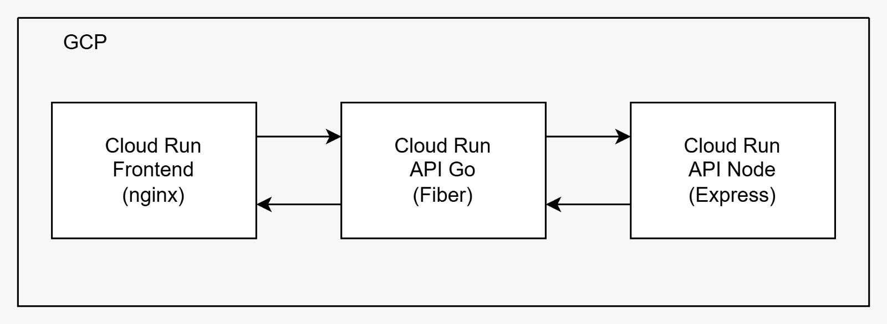
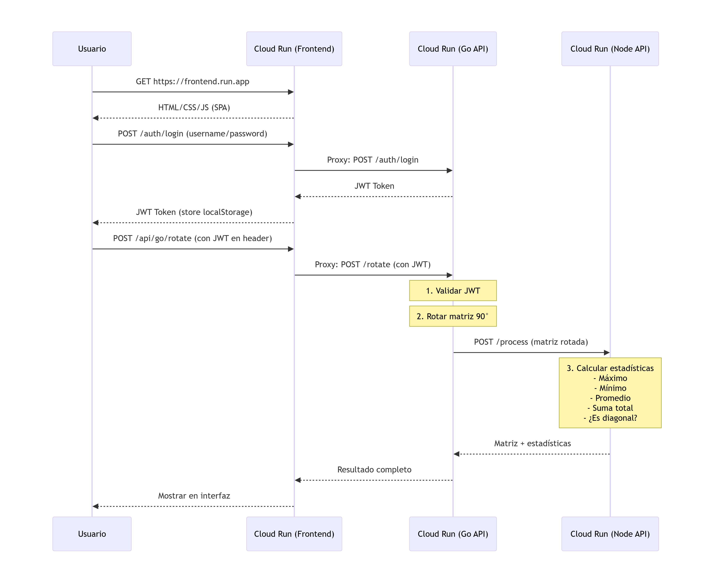

# Coding Challenge - Interseguro

Solución completa para el desafío técnico de Interseguro, el cual implementa un sistema de rotación de matrices y cálculo de estadísticas usando microservicios.

## 📋 Descripción del Sistema

Este proyecto consiste en tres componentes principales:

1. **API 1 (Go/Fiber)**: Servicio que recibe matrices, las rota 90° en sentido horario y coordina con API 2 para obtener estadísticas.
2. **API 2 (Node.js/Express)**: Servicio que calcula estadísticas sobre matrices (máximo, mínimo, promedio, suma total, verificación de diagonal).
3. **Frontend**: Interfaz web simple y moderna para interactuar con el sistema.

### Arquitectura en GCP




### Flujo de Datos

1. Usuario ingresa matriz en el frontend
2. Frontend realiza login para obtener JWT token
3. Frontend envía matriz a API 1 con JWT en header
4. API 1 valida JWT y rota la matriz 90° horario
5. API 1 envía matriz rotada a API 2
6. API 2 calcula estadísticas (max, min, promedio, suma, diagonal)
7. API 2 retorna matriz + estadísticas a API 1
8. API 1 retorna resultado completo al frontend
9. Frontend muestra matriz original, rotada y estadísticas

### Diagrama de Secuencia



## 🚀 Prerrequisitos

- **Docker** y **Docker Compose** (recomendado)
- **Go** 1.21+ (para desarrollo local sin Docker)
- **Node.js** 20+ y npm (para desarrollo local sin Docker)
- Cuenta de **Google Cloud** con permisos de Cloud Run

## 📦 Instalación y Ejecución con Docker

1. **Clonar el repositorio**:
   ```bash
   git clone <repository-url>
   cd coding-challenge
   ```

2. **Configurar variables de entorno** (opcional):
   ```bash
   cp .env.example .env
   # Editar .env según necesites
   ```

3. **Construir y levantar los servicios**:
   ```bash
   docker-compose up --build
   ```

4. **Acceder a la aplicación**:
   - Frontend: http://localhost:3000
   - API Go: http://localhost:8080
   - API Node.js: http://localhost:3001

## 🧪 Testing

### Tests Go

```bash
cd go-api
go mod tidy
go test ./tests/... -v
```

### Tests Node.js

```bash
cd node-api
npm install
npm test
```

### Cobertura

Para ver cobertura de tests:

```bash
# Go
cd go-api
go test ./tests/... -cover

# Node.js
cd node-api
npm test -- --coverage
```

## 📡 Uso de las APIs

### 1. Autenticación (Login)

**Endpoint**: `POST /auth/login`

```bash
curl -X POST http://localhost:8080/auth/login \
  -H "Content-Type: application/json" \
  -d '{
    "username": "admin",
    "password": "admin123"
  }'
```

**Respuesta**:
```json
{
  "token": "eyJhbGciOiJIUzI1NiIs...",
  "expires_in": 3600
}
```

### 2. Rotar Matriz y Obtener Estadísticas

**Endpoint**: `POST /rotate`

```bash
curl -X POST http://localhost:8080/rotate \
  -H "Content-Type: application/json" \
  -H "Authorization: Bearer <token>" \
  -d '{
    "matrix": [[1,2,3],[4,5,6],[7,8,9]]
  }'
```

**Respuesta**:
```json
{
  "original_matrix": [[1,2,3],[4,5,6],[7,8,9]],
  "rotated_matrix": [[7,4,1],[8,5,2],[9,6,3]],
  "statistics": {
    "max_value": 9,
    "min_value": 1,
    "average": 5,
    "total_sum": 45,
    "is_diagonal": false,
    "calculation_time_ms": 2.1
  },
  "processing_time_ms": 25.3
}
```

## 🔐 Seguridad

- **JWT Authentication**: Todos los endpoints protegidos requieren un token JWT válido
- **Token Expiration**: Tokens expiran después de 1 hora (configurable)
- **Secret Key**: JWT secret configurado via variable de entorno

## ⚙️ Variables de Entorno

### **Puertos de los Servicios**
- `API1_PORT` - API Go (rotación de matrices)
- `API2_PORT` - API Node.js (estadísticas)
- `FRONTEND_PORT` - Frontend web

### **Autenticación JWT**
- `JWT_SECRET`
- `JWT_EXPIRATION` (1 hora)
- `AUTH_USERNAME`
- `AUTH_PASSWORD`

### **Configuración de APIs**
- `API2_URL` - Comunicación Go → Node
- `API_BASE_URL` - Frontend → Go API
- `LOG_LEVEL` - Nivel de logging


## 🎯 Funcionalidades Implementadas

### API 1 (Go/Fiber)

- ✅ Rotación de matriz 90° en sentido horario
- ✅ Autenticación JWT (login endpoint + middleware)
- ✅ Comunicación HTTP con API 2 (con retry y timeout)
- ✅ Validación de matrices (estructura, tamaño)
- ✅ Logging estructurado con request IDs
- ✅ Health check endpoint
- ✅ Manejo robusto de errores
- ✅ CORS configurado para frontend

### API 2 (Node.js/Express)

- ✅ Cálculo de estadísticas (max, min, promedio, suma)
- ✅ Verificación de matriz diagonal (para matrices cuadradas)
- ✅ Validación de matrices
- ✅ Logging estructurado con Winston
- ✅ Health check endpoint
- ✅ Manejo de errores

### Frontend

- ✅ Interfaz moderna y responsive
- ✅ Login con JWT
- ✅ Input de matriz (formato JSON)
- ✅ Visualización de matriz original y rotada
- ✅ Visualización de estadísticas
- ✅ Manejo de errores y estados de carga
- ✅ Persistencia de token en localStorage

## 🔧 Decisiones Técnicas

### Arquitectura de Microservicios

**Arquitectura elegida:** 3 contenedores separados (Go API + Node API + Frontend) desplegados como 3 servicios Cloud Run independientes.

- **Microservicios** → Cumple requerimiento de APIs que se comunican
- **Escalabilidad independiente** → Cada servicio escala según su carga
- **Aislamiento** → Fallo en un servicio no afecta los demás
- **Serverless** → Cloud Run maneja infraestructura, HTTPS gratis, pago por uso

## 🚀 Instrucciones de Despliegue

Los microservicios se desplegaron usando **gcloud run deploy** desde el código fuente.

### Requisitos
- Google Cloud SDK instalado
- Proyecto configurado (`gcloud config set project <PROJECT_ID>`)
- Cloud Run y Cloud Build habilitados

### Orden de despliegue
1. node-api  
2. go-api  
3. frontend  

### node-api
```bash
gcloud run deploy node-api \
  --source ./node-api \
  --platform managed \
  --region us-central1 \
  --allow-unauthenticated \
  --port 3001 \
  --set-env-vars "API2_PORT=3001,LOG_LEVEL=info,NODE_ENV=production" \
  --memory 512Mi \
  --cpu 1 \
  --timeout 300 \
  --max-instances 10 \
  --min-instances 0
```

### go-api
```bash
gcloud run deploy go-api \
  --source ./go-api \
  --platform managed \
  --region us-central1 \
  --allow-unauthenticated \
  --port 8080 \
  --set-env-vars "API1_PORT=8080,API2_URL=https://node-api-16817262424.us-central1.run.app,JWT_SECRET=<JWT_SECRET>,JWT_EXPIRATION=3600,LOG_LEVEL=info,AUTH_USERNAME=<AUTH_USERNAME>,AUTH_PASSWORD=<AUTH_PASSWORD>" \
  --memory 512Mi \
  --cpu 1 \
  --timeout 300 \
  --max-instances 10 \
  --min-instances 0
```

### frontend
```bash
gcloud run deploy frontend \
  --source ./frontend \
  --platform managed \
  --region us-central1 \
  --allow-unauthenticated \
  --port 8080 \
  --set-env-vars "API_BASE_URL=https://go-api-16817262424.us-central1.run.app" \
  --memory 256Mi \
  --cpu 1 \
  --timeout 300 \
  --max-instances 10 \
  --min-instances 0
```

> Nota: Reemplazar las URLs por las generadas en tu proyecto de GCP.


## 📝 Notas de Desarrollo

- Las credenciales por defecto son `admin/admin123` (cambiar en producción)
- El JWT secret debe ser cambiado en producción
- Los timeouts y retry logic están configurados pero pueden ajustarse según necesidades
- Los health checks están configurados en docker-compose para asegurar disponibilidad